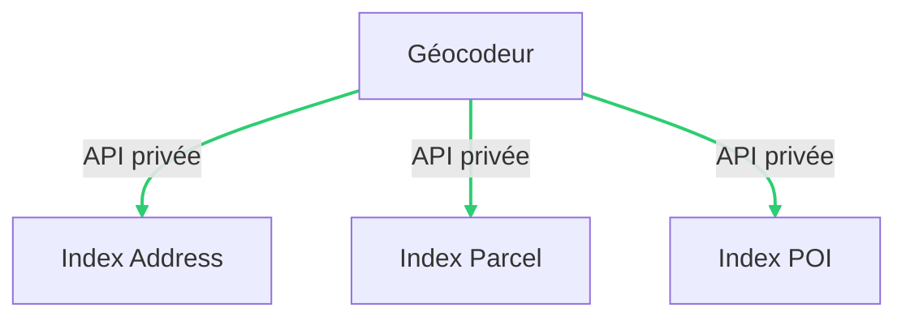

# geocodeur

## Architecture



## Prerequisites

- 7z (`p7zip` / `p7zip-full`)
- Redis 6 / Redis 7
- Python 3.9 / 3.10 / 3.1 (`pyenv`)
- Addok (`pip install addok addok-france addok-fr`)
- Node.js 18 LTS and above
- Yarn

## Copy and edit env file

```bash
cp .env.sample .env
```

| Environment variable name | Description | Default |
| --- | --- | --- |
| `PORT` | Port node will use to start the server | `3000` |
| `ADDRESS_SERVICE_PORT` | Port used by address service | `3001` |
| `PARCEL_SERVICE_PORT` | Port used by parcel service | `3002` |
| `POI_SERVICE_PORT` | Port used by POI service | `3003` |
| `GEOCODE_INDEXES` | Indexes to load | `address,parcel,poi` |
| `ADDRESS_INDEX_URL` | URL to serve address index | `http://localhost:3001` |
| `PARCEL_INDEX_URL` | URL to serve parcel index | `http://localhost:3002` |
| `POI_INDEX_URL` | URL to serve POI index | `http://localhost:3003` |
| `CORS_DISABLE` | Set to `1` to disable CORS policy | `0` |
| `PARCELLAIRE_EXPRESS_URL` | URL of parcel database (Official SHP archive in `7z`) | `https://gpf-ign-data.s3.sbg.io.cloud.ovh.net/parcellaire-express/PARCELLAIRE_EXPRESS_1-1__SHP_{crs}_{dep}_2023-01-01.7z`|
| `ADMIN_EXPRESS_URL` | URL of IGN’s ADMIN EXPRESS (Official SHP archive in `7z`) | `https://gpf-ign-data.s3.sbg.io.cloud.ovh.net/admin-express/ADMIN-EXPRESS-COG_3-2__SHP_WGS84G_FRA_2023-05-03.7z` |
| `BDTOPO_URL` | URL of the public IGN database | `https://gpf-ign-data.s3.sbg.io.cloud.ovh.net/bdtopo/BDTOPO_3-3_TOUSTHEMES_GPKG_{crs}_{dep}_2023-03-15.7z`|
| `DEPARTEMENTS` | List of departements to limit data | `empty` |
| `TMP_PATH` | Path to the `tmp` folder | `./tmp` |
| `DATA_PATH` | Path to the `data` folder | `./data` |

***Required**

## Install dependencies

```bash
yarn
```

## Build datas / indexes

```bash
yarn poi:build-from-bdtopo
yarn poi:build-index
yarn parcel:build-index
yarn address:build-index
```

## Start server / services
> In 4 differents shells

```bash
yarn api:start
yarn poi:start
yarn parcel:start
yarn address:start
```

*TODO city parameter, reverse, autocomplete, POI*

## Install with docker-compose

### Prepare address data (with French BAN)

- Download

```bash
wget https://adresse.data.gouv.fr/data/ban/adresses/latest/addok/addok-france-bundle.zip -O data.zip
```

- Extract

```bash
unzip data.zip -d ./data
```

- Remove zip archive

```bash
rm data.zip
```

### Run docker-compose

```bash
docker-compose up -d
```
