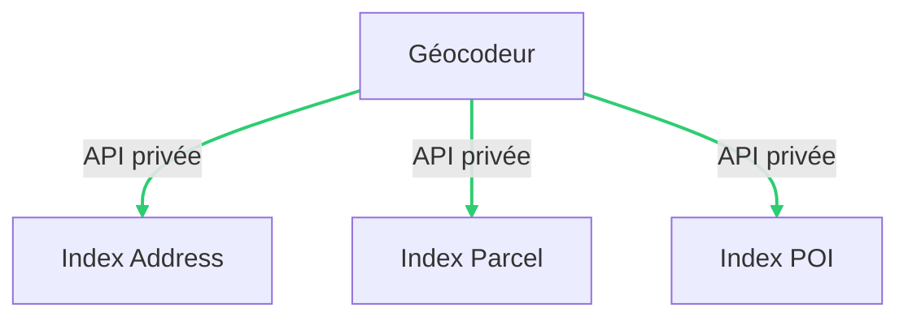

# geocodeur

## Architecture



## Prerequisites

- Node.js 18 LTS and above

## Copy and edit env file

```bash
cp .env.sample .env
```

| Environment variable name | Description | Default |
| --- | --- | --- |
| `PORT` | Port node will use to start the server | `3000` |
| `GEOCODE_INDEXES` | Indexes to load | `address,parcel,poi` |
| `ADDRESS_ADDOK_SERVER_URL`* | An Addok server URL for address index | |
| `CORS_DISABLE` | Set to `1` to disable CORS policy | `0` |

***Required**

## Install dependencies and start node server

```bash
yarn && yarn start
```

*TODO city parameter, reverse, autocomplete, POI*

## Install with docker-compose

### Prepare address data (with French BAN)

- Download

```bash
wget https://adresse.data.gouv.fr/data/ban/adresses/latest/addok/addok-france-bundle.zip -O data.zip
```

- Extract

```bash
unzip data.zip -d ./data
```

- Remove zip archive

```bash
rm data.zip
```

### Run docker-compose

```bash
docker-compose up -d
```
