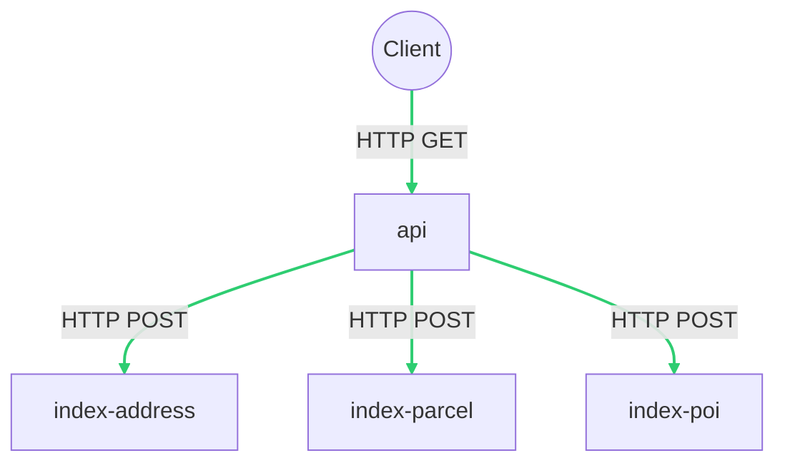
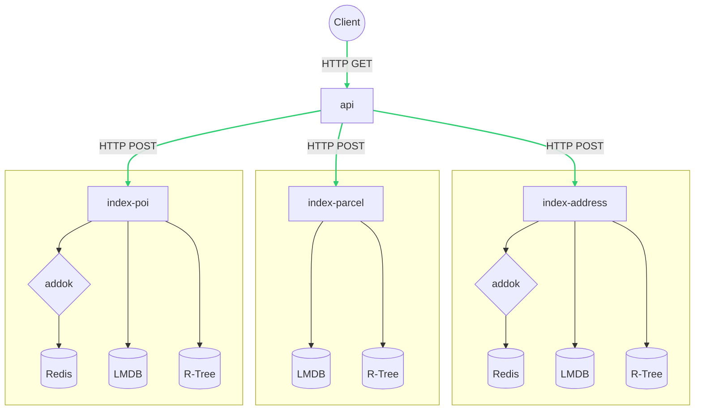

# Architecture du service

Le géocodeur multi-thématique de la Géoplateforme est une API permettant d'interroger simultanément 3 grandes typologies de données :

- les adresses, voies et lieux-dits de la [Base Adresse Nationale](https://adresse.data.gouv.fr) ;
- les points d’intérêt issus de la BD TOPO ;
- les parcelles catastrales de la base Parcellaire Express.

Chacune de ces typologies est incarnée par un composant logiciel fortement couplé aux données que l’on appelera `index`. Ces composants peuvent _scaler_ indépendamment en fonction de la charge et de l’intérêt des utilisateurs pour telle ou telle thématique.

Ces composants prennent la forme d’un service HTTP.

Le géocodeur à proprement parler est une API dont la responsabilité est de valider la requête de l’utilisateur, d’interroger les `indexes` concernés, et de retourner une réponse consolidée.

## Schéma simplifié

## Fonctionnalités et index

3 fonctionnalités principales sont proposées par le service :

- la recherche textuelle ou géocodage simple (avec ou sans auto-complétion) ;
- la recherche spatiale ou géocodage inversé
- la recherche structurée (sur la base de critères multiples)

Chaque typologie de données ne dispose pas des mêmes fonctionnalités.

| Index | Recherche textuelle | Recherche spatiale | Recherche structurée |
| --- | --- | --- | --- |
| `address` | ✅ | ✅ | ❌ |
| `poi` | ✅ | ✅ | ❌ |
| `parcel` | ❌ | ✅ | ✅ |

Pour la __recherche textuelle__, c'est le logiciel [addok](https://addok.readthedocs.io) qui est utilisé. Il s'appuie sur une base de données [Redis](https://redis.io) qui doit être localisée au plus prêt du moteur afin d’optimiser le temps de réponse.

Pour les __recherches spatiales et structurée__, le moteur fait partie du composant et s'appuie sur [LMDB](https://www.symas.com/lmdb), une base de données _clé-valeur_ embarquée haute performance, et sur une structure _R-Tree_ implémentée grâce à la bibliothèque [Flatbush](https://github.com/mourner/flatbush).

## Schéma détaillé

## Exigences techniques

Les composants `index-address`, `index-poi` et `index-parcel` doivent être exécutés sur des machines disposant de processeurs rapides afin d’optimiser le temps de réponse.

Les données (en particulier les fichiers LMDB) devront être hébergées sur un disque SSD __local__, idéalement de type NVMe. En effet LMDB s’appuie sur une technologie appellée [memory-mapping (MMAP)](https://en.wikipedia.org/wiki/Memory-mapped_file) qui nécessite des temps de réponse très bas pour des accès aléatoires très fréquents. Une quantité non négligeable de mémoire vive sera aussi requise pour faire tenir les bases Redis et les structures R-Tree en RAM. Concernant LMDB, plus la quantité de RAM allouée sera importante, plus les pages mémoires seront fréquemment disponibles en RAM, et plus les performances seront bonnes.

⚠️ On évitera à tout prix d’héberger les fichiers LMDB sur des stockages distants, à moins d’utiliser des technologies de pointe garantissant un grand nombre d’IOPS ainsi que des temps de réponse extrèmement bas.

| Composant | Exigence CPU | Exigence RAM | Exigence disque |
| --- | --- | --- | --- |
| `api` | Moyen à rapide | 1 Go | N/A |
| `index-address` | Rapide | >= 8 Go | 10 Go SSD |
| `index-poi` | Rapide | >= 8 Go | 6 Go SSD |
| `index-parcel` | Rapide | >= 5 Go | 40 Go SSD |
