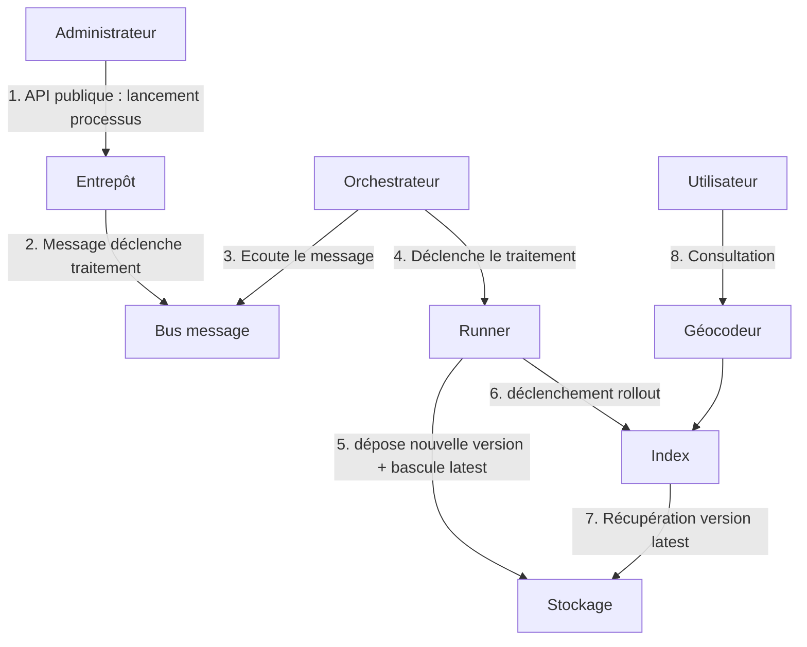

# Lancer une réindexation sur la géoplateforme

**NOTE:**  Les processings ne prennent pas de paramètre pour le moment.

## Pré requis

Il faut avoir un datastore configuré dans l'entrepôt.

## Principe



## Procédure

En utilisant les apis entrepôts de l'environnement souhaité :

* Faire un appel `/datastores/{{DATASTORE_ID}}/processings` pour récupérer l'identifiant du processus

```json
 {
        "name": "Géocodeur Poi",
        "description": "Géocodeur Poi",
        "_id": "XXXX"
    },
    {
        "name": "Géocodeur Parcel",
        "description": "Géocodeur Parcel",
        "_id": "YYYY"
    },
    {
        "name": "Géocodeur Adresse",
        "description": "Géocodeur Adresse",
        "_id": "ZZZZ"
    },
```

* Déclencher le traitement par l'appel `/datastores/{{DATASTORE_ID}}/processings/{{PROCESSING_ID}}/launch`

## Paramètrages

Les paramètres des procédures sont actuellement en dur. Il n'est pas prévu dans l'immédiat des les rendre paramétrables.

### POI

Variable | Description | Valeur
---------|----------|---------
 ADMIN_EXPRESS_URL |  Structure d'URL du millésime ADMIN COG à utiliser | <https://gpf-ign-data.s3.sbg.io.cloud.ovh.net/admin-express/ADMIN-EXPRESS-COG_3-2__SHP_WGS84G_FRA_2023-05-03.7z>
 BDTOPO_URL | Structure d'URL du millésime BD TOPO à utiliser | <https://gpf-ign-data.s3.sbg.io.cloud.ovh.net/bdtopo/BDTOPO_3-3_TOUSTHEMES_GPKG_{crs}_{dep}_2023-09-15.7z>

### Adresses

Variable | Description | Valeur
---------|----------|---------
 BAN_ADDOK_URL | Structure d'URL du millésime BAN Addok à utiliser | <https://adresse.data.gouv.fr/data/ban/adresses/latest/addok/adresses-addok-{dep}.ndjson.gz>

### Parcelles

Variable | Description | Valeur
---------|----------|---------
 PARCELLAIRE_EXPRESS_URL |  Structure d'URL du millésime PARCELLAIRE EXPRESS à utiliser | <https://gpf-ign-data.s3.sbg.io.cloud.ovh.net/parcellaire-express/PARCELLAIRE_EXPRESS_1-1__SHP_{crs}_{dep}_2023-07-01.7z>

## Suivi

Les logs du traitement une fois lancé sont disponibles via l'appel `/datastores/{{DATASTORE_ID}}/processings/{{PROCESSING_ID}}/logs`
